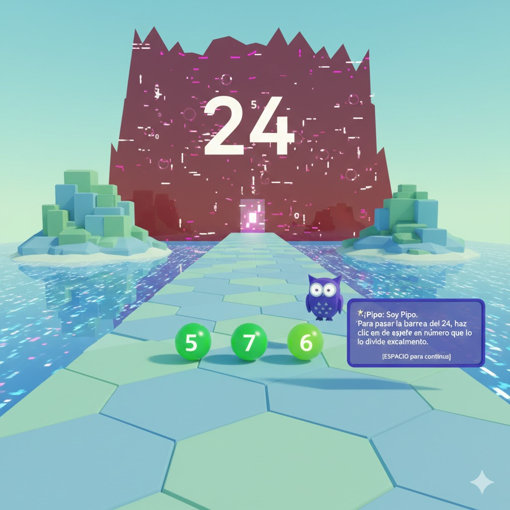
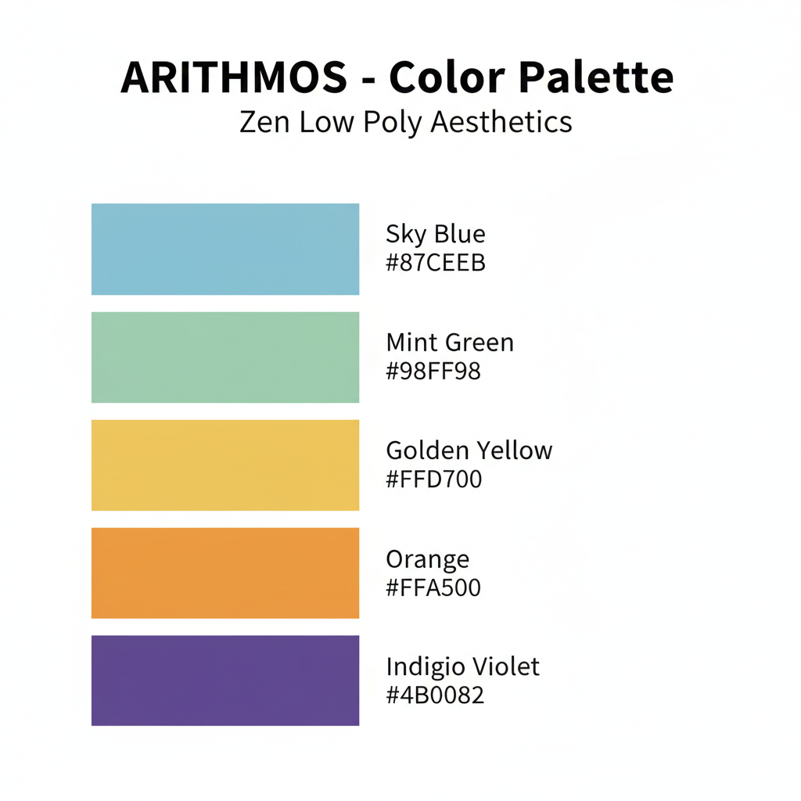

# D. Arte, Mockups y Estética (Visión Final del Proyecto)

Este documento detalla la dirección artística y la experiencia sensorial que definen la versión final de Arithmos, diseñada para ser un entorno de aprendizaje "Zen" y épico a la vez.

## 1. Dirección de Arte Visual (Concepto "Soft Low Poly")

La estética final busca la "Inmersión Pacífica". El mundo no debe sentirse como un salón de clases, sino como un reino antiguo y tecnológico construido con bloques de luz y formas puras.

- **Estilo Visual:** Minimalismo Low Poly con sombreado plano (Flat Shading) para eliminar distracciones visuales.
- **Referencia Estética:** La geometría imposible de Monument Valley y la iluminación etérea de The Witness.
- **Atmósfera:** Espacios amplios y limpios que invitan a la reflexión antes de la acción.

 **Ejemplo: NIVEL 4: El Río Divisor**

 

## 2. Paleta de Colores Funcional (Color-Coding)

El color en Arithmos es una herramienta pedagógica que guía al estudiante sin necesidad de menús invasivos:

- **Entorno (Fondo):** Tonos pasteles fríos (Azul Cielo `#87CEEB`, Verde Menta `#98FF98`) para mantener un estado mental de calma y reducir la ansiedad ante el error.
- **Objetos de Puzzle:** Colores cálidos y vibrantes (Naranja `#FFA500`, Amarillo `#FFD700`) para señalizar los elementos interactuables.
- **El Glitch (Obstáculo):** Estática roja semitransparente que representa la confusión matemática que debe ser "reparada".

## 3. Diseño de Audio y Paisaje Sonoro (Soundscape)

La música es el motor emocional del juego. Su objetivo es que el niño se sienta un héroe en una aventura sin prisa.

- **Filosofía Musical:** Estilo Ambient Orchestral con piano, flautas y cuerdas suaves.
- **Tempo:** Ritmo lento (60-80 BPM) que coincide con el ritmo cardíaco en reposo para evitar la sensación de urgencia.
- **Feedback Auditivo Procedural:**
  - **Acierto:** Un arpegio ascendente de arpa o campanillas que genera satisfacción inmediata.
  - **Fallo:** Un tono grave y seco (tipo percusión de madera) que indica error sin ser punitivo o estridente.

## 4. Mockup de Interfaz de Usuario (UI/UX)

La visión para la interfaz es el Minimalismo Absoluto:

- **HUD Invisible:** No existen barras de vida ni cronómetros para no generar presión externa.
- **Diálogos Diegéticos:** Las instrucciones de Pipo aparecen proyectadas directamente en el espacio 3D, manteniendo al jugador inmerso en el mundo en lugar de leer menús planos.
- **Cursor Reactivo:** El puntero cambia de forma al detectar un objeto interactuable, eliminando la duda sobre dónde se puede hacer clic.

---

**Nota Final:** Este diseño artístico tiene como objetivo transformar la percepción de las matemáticas: de ser una tarea abstracta y estresante a ser una llave mágica que restaura el color y el orden en un mundo fantástico.

**MockUp Pantalla Principal**

